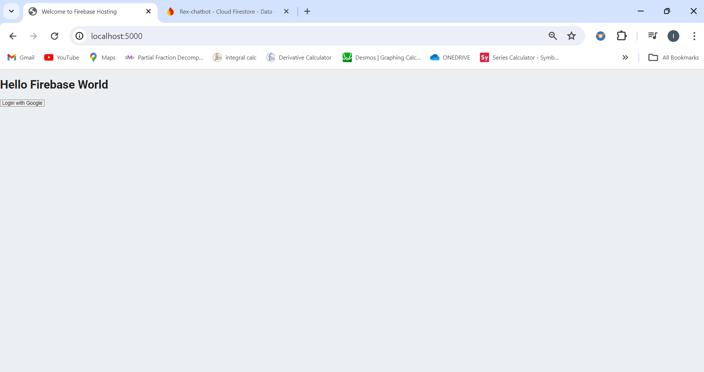
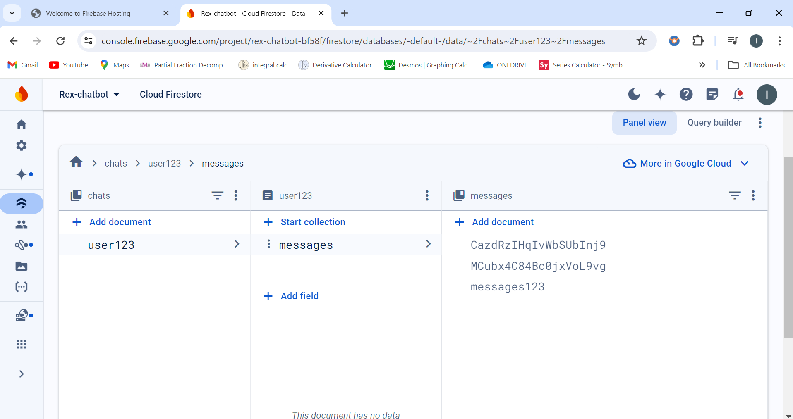
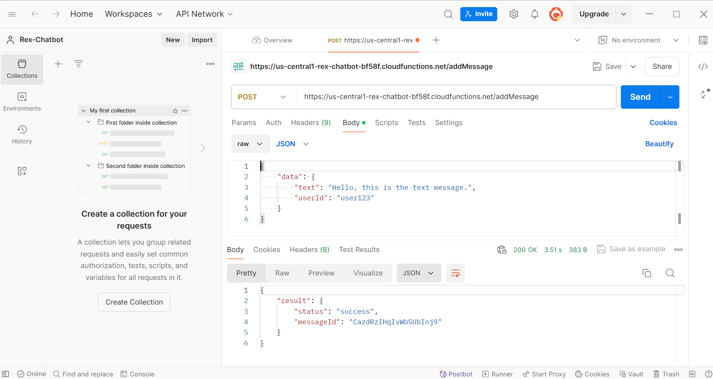

# Getting Started with Firebase

This is a mini project based on firebase to have an API endpoint using firebase function 
and then deploying it to the cloud. Also, then the endpoint can be tested using Postman

### Firebase running on the local host

### Firebase Console

### Testing the deployed API endpoint on Postman

